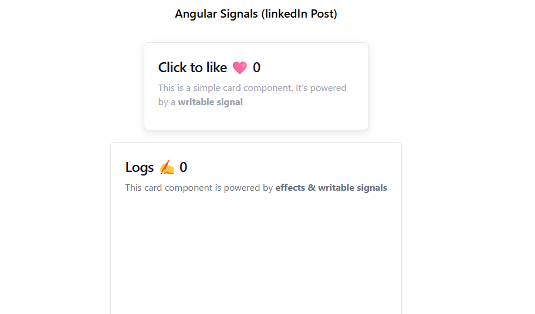

# Angular Logs Project with Signals & Effects

This project is a practical implementation of **Angular signals and effects** to dynamically display and manage log entries. Created as a companion to my LinkedIn posts, this project is designed to support developers aiming to understand Angular's reactive signals and effects.

## Project Overview

The goal of this project is to:
- Provide hands-on examples of **writable signals** and **effects** in Angular.
- Serve as a practical learning resource for anyone interested in exploring Angular's new reactive approach.

The application features a logging component where log entries appear interactively, each with a description and timestamp. This project showcases how signals and effects work together to build dynamic, reactive components in Angular.

## Screenshots

**Logs & Likes View**

**Dynamic Signal Updates**

## Key Features

- **Writable Signals**: Demonstrates the use of writable signals for managing log data.
- **Angular Effects**: Implements effects to track updates to log entries.
